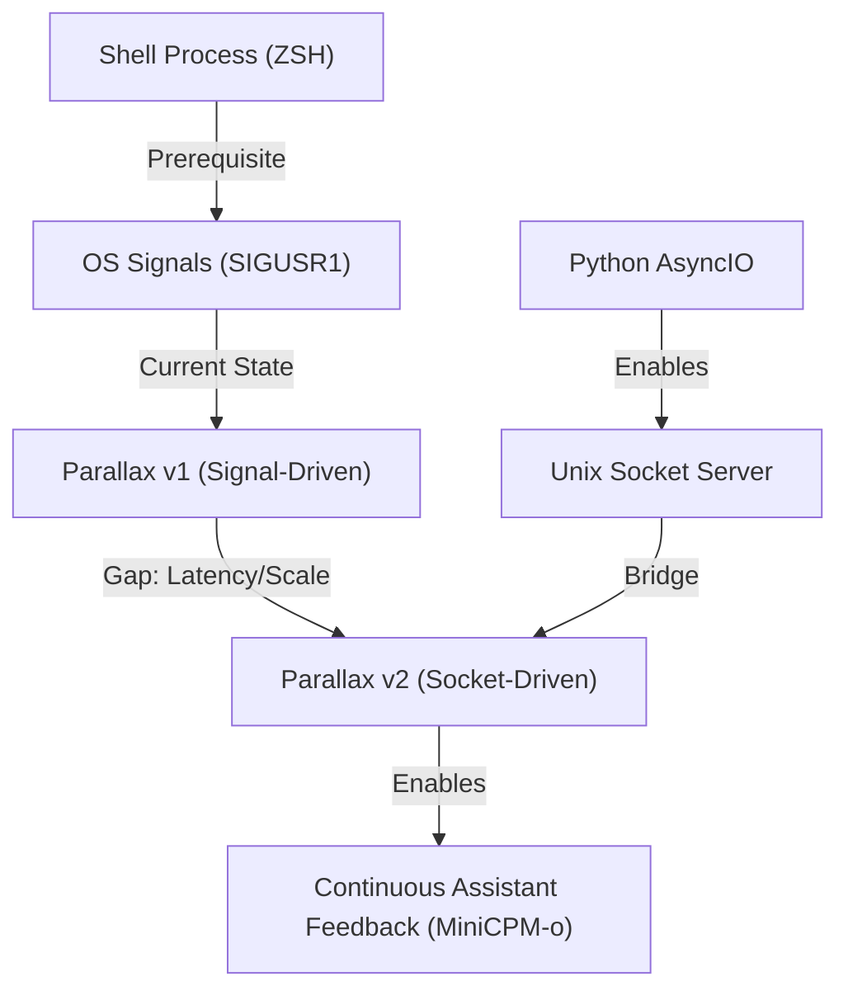

# Learning Design: Parallax Socket Transition

## Pedagogical Architecture

### Concept Map

## The Socratic Strategy
**Approach:** Bottom-up Construction (The "Pulse").
We will start by breaking the "Signal" bridge intentionally. The Student will observe the friction of lost messages under high frequency. We then introduce the "Always-On" line.

### Pedagogical Invariants (Dependencies)
*Just as code has invariants, understanding has dependencies.*

**Invariant 1:**
*For any* Student to understand **Persistent Connection**, they MUST first experience the **Statelessness** of Signal/File polling.
**Validates: Objective 1**

**Invariant 2:**
*For any* implementation of a Shell Listener, the Student MUST understand the difference between **Sourcing a file** (Security Risk) and **Parsing a Command** (Sovereign Control).
**Validates: Objective 2**

## Verification Method
**Theory Check:** Explain the "Clogged Doorbell" metaphor versus the "Phone Queue."
**Practical Check:** Move the existing `px-link` logic from `TRAPUSR1` into a persistent `nc -U` loop (or Python shim).
