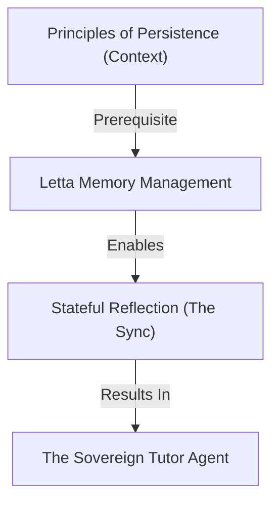

# Learning Design: The Sovereign Tutor (Letta Integration)

## Pedagogical Architecture

### Concept Map

## The Socratic Strategy
**Approach**: **Reflection-Driven Development**. The agent's intelligence is directly fueled by the Student's `reflection.md` entries. If the Student doesn't reflect, the agent "starves" of context.

### Pedagogical Invariants (Dependencies)

**Invariant 1**:
*For any* Student to build a Sovereign Tutor, they MUST first master **JSON serialization** (reading/writing their own progress).
**Validates: Objective 1**

**Invariant 2**:
*For any* implementation of persistent memory, the Student MUST differentiate between **Automated State Tracking** (the machine) and **Manual Reflection** (the human).
**Validates: Objective 2**

## Verification Method
**Theory Check**: The Student must describe how they would "reboot" their tutor if it gets confused (Archival Memory clearing).
**Practical Check**: The Student builds `tutor_sync.py` which reads their `reflection.md` and updates a local Letta database.
