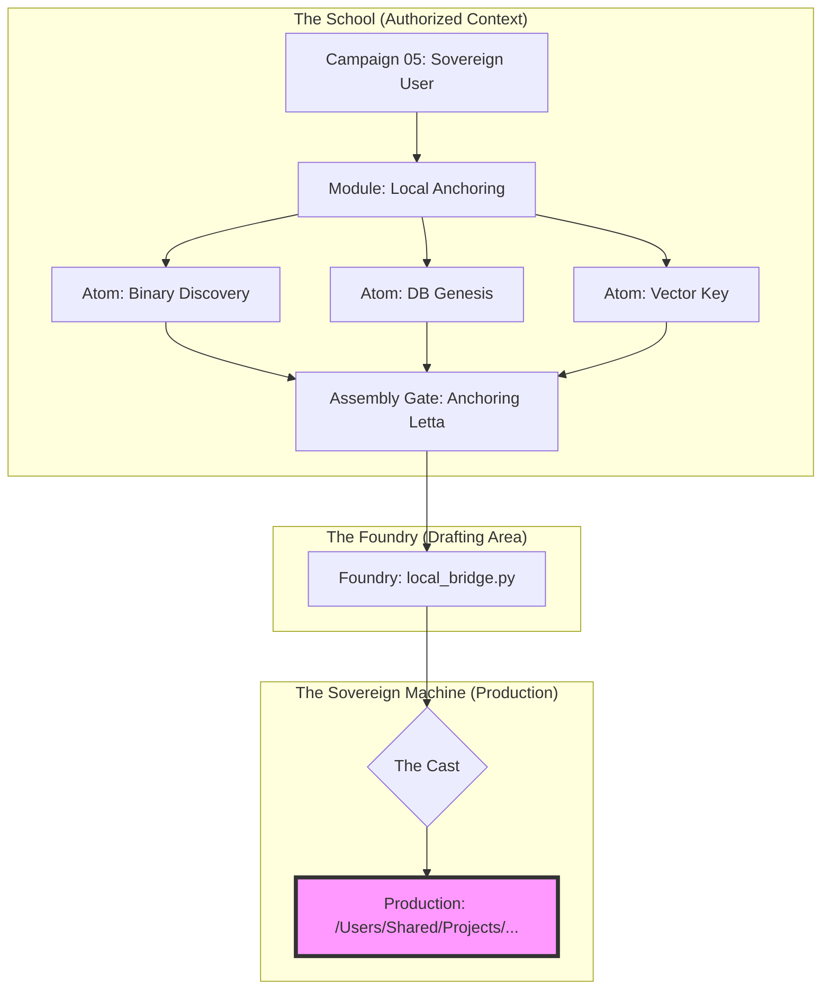

# System Architecture: The School of First Principles

This document defines the structural and security integration between the **Sovereign Machine** and the **School Council**.

## 1. The Security Layer (GAP)
The School operates as a **Sovereign Domain** within the Gated Agent Protocol (GAP).
- **Domain Identity**: `sovereign/school-of-first-principles`
- **Inheritance**: Extends `core/instructional` (The Blueprint for Pedagogical Work).
- **Inheritance Logic**:
    - **Inherits**: Standard Instructional Gates (Draft -> Review -> Publish).
    - **Inherits**: Standard Roles (Author, Reviewer).
    - **Overrides**: Adds `Reflective Locking` and specific `school-of-first-principles` paths.
- **Enforcement**: ACLEnforcer blocks all execution and restricts writes to authorized `.md` paths.

## 2. The Atomic Data Flow
We utilize an **Atomic Curriculum** strategy to ensure high-fidelity knowledge transfer:

## 3. The Council Matrix
The School is staffed by specialized agent identities, each governed by specific GAP roles:

| Council Role | GAP Role | Responsibility |
| :--- | :--- | :--- |
| **Librarian** | `archivist` | Memory linkage & Prerequisite mapping. |
| **Tutor** | `instructor` | Socratic guidance & Reflective Gate validation. |
| **Critic** | `reviewer` | Foundry code audit & security checking. |
| **Smith** | `drafter` | Initial blueprint generation (MD-only). |

## 4. Operational Invariants
1. **Zero-Execution**: AI agents are physically blocked from running shell commands.
2. **Reflective Locking**: Progress requires human-written `reflection.md`.
3. **Manual Casting**: Only the Sovereign (User) can move code from the Foundry to Production.
