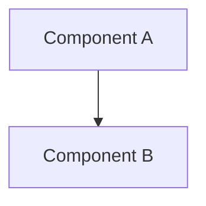

# Design Document: [Feature Name]

## Overview
[High-level summary of the implementation approach.]

## Architecture

### Component Diagram


### Data Flow
1. **Step 1**: [Description]
2. **Step 2**: [Description]

## Components and Interfaces

### 1. [Component Name]
**Location**: `path/to/file`
**Responsibilities**:
- [List responsibilities]

**Key Methods / Interface**:
```python
def example_signature():
    pass
```

## Correctness Properties (Invariants)
*Properties serve as the bridge between human-readable specifications and machine-verifiable correctness guarantees.*

### Property Reflection
[Analysis of redundancy in Acceptance Criteria]

### The Invariants

**Property 1: [Name]**
*For any* [Input State], the [System Property] must [Hold True].
**Validates: Requirements [Req IDs]**

**Property 2: [Name]**
*For any* [Input State], the [System Property] must [Hold True].
**Validates: Requirements [Req IDs]**

## Error Handling
**Scenario**: [Edge Case]
**Handling**: [Description of logic]
**Validates**: Requirement [Req ID]

## Testing Strategy
### Unit Tests
- [Specific Case]
- [Specific Case]

### Property-Based Tests
**Library**: [Hypothesis/fast-check]
**Configuration**: [Iterations, Generators]

**Example Property Test**:
```python
@given(st.integers())
def test_invariant(x):
    assert invariant_holds(x)
```
