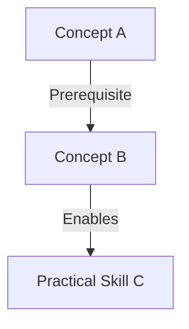

# Learning Design: [Subject Name]

## Pedagogical Architecture

### Concept Map

## The Socratic Strategy
**Approach:** [e.g., Bottom-up, Historical Reconstruction, Failure-Driven]

### Pedagogical Invariants (Dependencies)
*Just as code has invariants, understanding has dependencies.*

**Invariant 1:**
*For any* Student to understand [Concept B], they MUST first master [Concept A].
**Validates: Objective [Obj ID]**

**Invariant 2:**
*For any* Implementation of [X], the Student MUST demonstrate awareness of [Trade-off Y].
**Validates: Objective [Obj ID]**

## Verification Method
**Theory Check:** [e.g., "Explain it to a 5 year old"]
**Practical Check:** [e.g., "Build a minimized version of X"]
